# Lesson 1: Introduction

This nanodegree will try to make the basis of self driving cars very accessible to a wider audience. Some of the topics that will be studied are:

- data structure
- basic math
- different programming languages
- planning
- perception
- control
- bayes rules
- etc.

The goal is to make the student, by the end of the course, a very knowledgable person about self-driving cars. There is an advance version to continue the student's studies after completing the program.

The slack channel can be accessed [here](https://introtocar.slack.com)

AMA session [here](https://www.youtube.com/watch?v=Ap8xp3LZmdM)

## 1.1 Meet the team

- Anthony Navarro: product lead

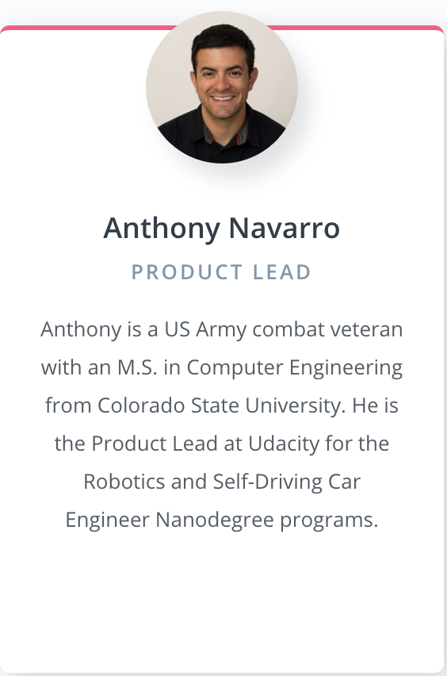

- Andy Brown: curriculum lead (path planning and localization)


- Cezanne Camacho: course developer (line finding and computer vision)


- Elicia White: instructor (embedded systems engineer)

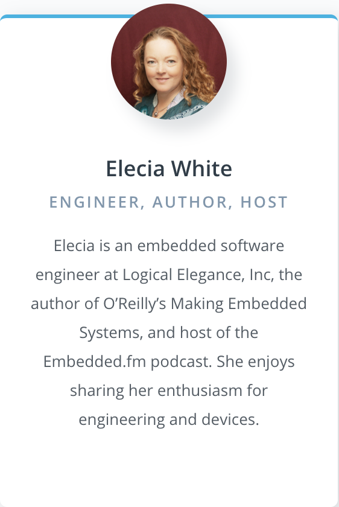

- Tarin Ziyaee: instructor (artificial intelligence)

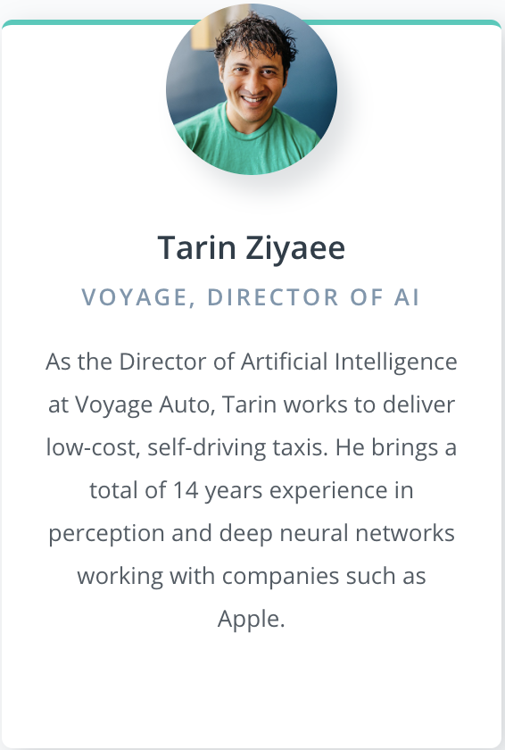

- Jessica Lulovics: program manager

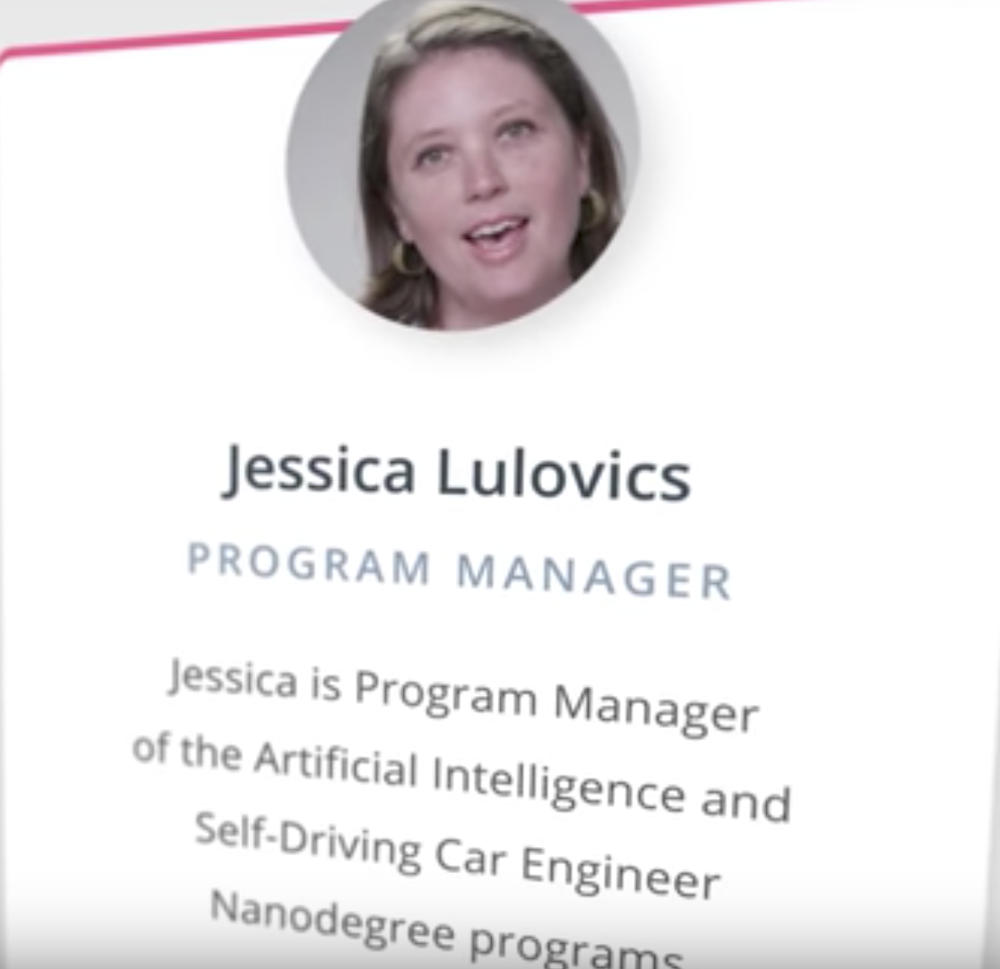

- Erika Alonzo: student experience coordinator


- Sebastian Thurn: Udacity president


- Andrew Pasteur: content developer


## 1.2 Expectations about the nanodegree

This curriculum was designed for beginner programmers, that are comfortable with algebra, and that are passionate about solving hard problems with math. This program will prepare the students for the more advance curriculum.

***

# Lesson 2: The Carla Chronicles (back to track)
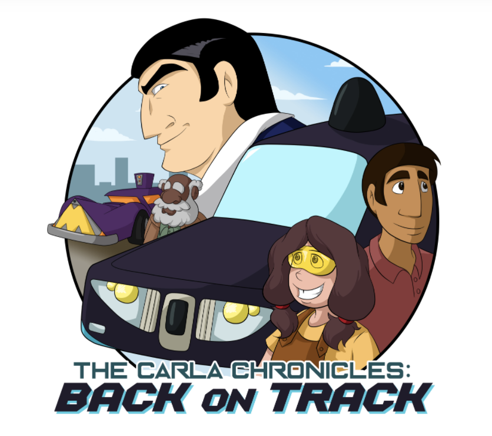

This is a self evaluation of the student math and programming skills.

## 2.1 Meet the crew
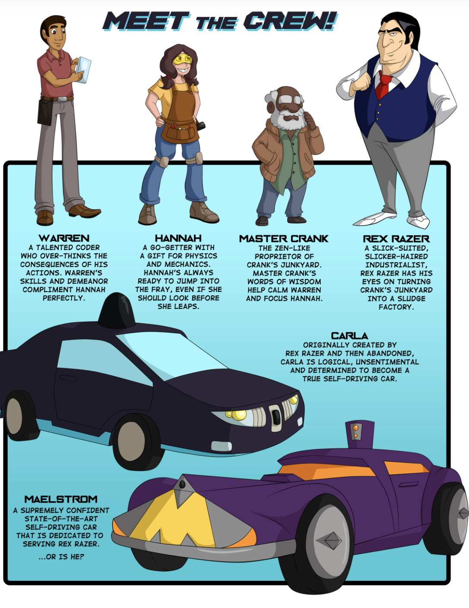

## 2.2 Wheel size matters
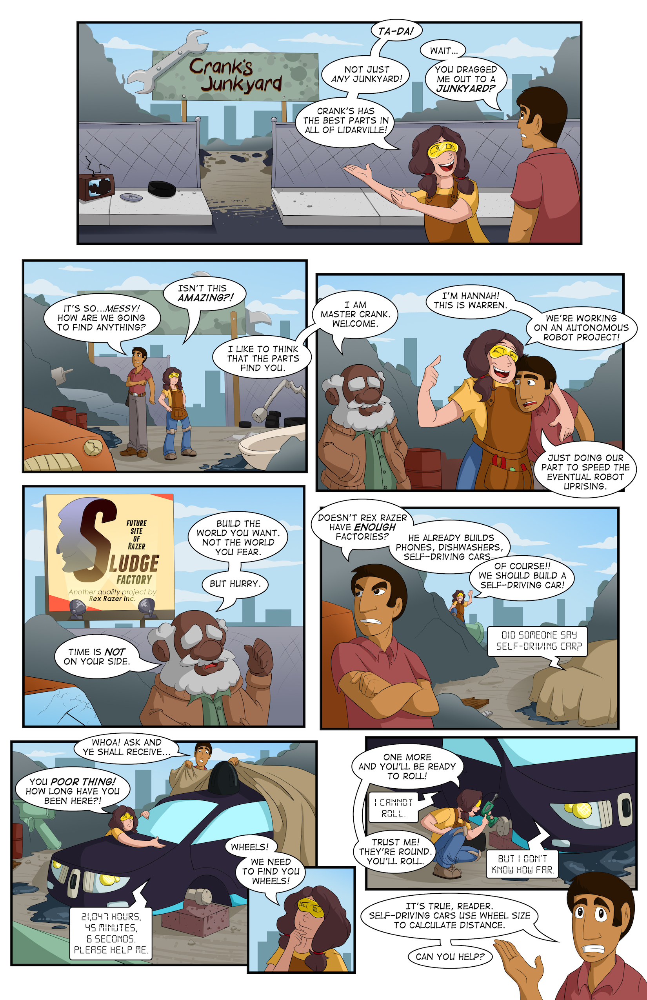
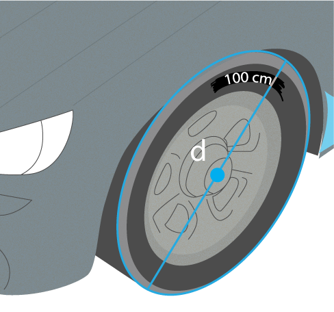

About how far will Carla roll forward with **one full rotation** of her tires?

```python
import math

TIRE_DIAMETER = 100

def circumference(diameter):
    '''C = πd'''
    return math.pi * diameter


one_full_rotation = circumference(TIRE_DIAMETER)
print(one_full_rotation) # ~314.1593
```

## 2.3 Lost in space
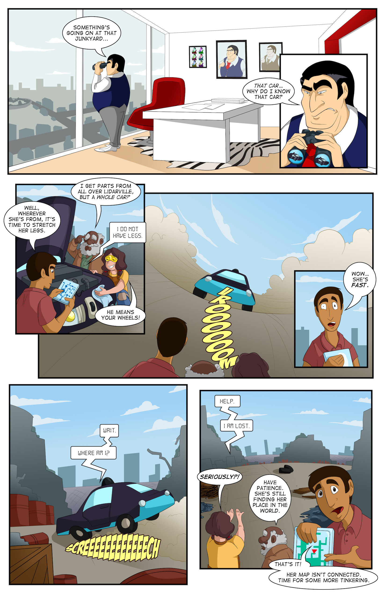

### 2.3.1 Help Carla localize herself
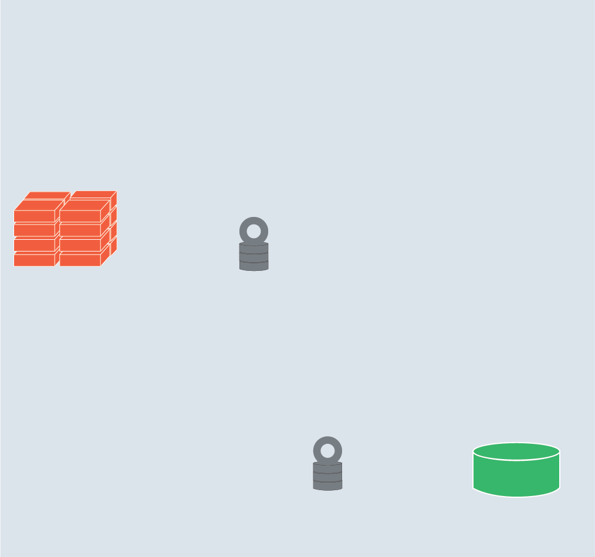

Location unknown. I am located between a pile of bricks and a green bucket. Old tire directly to my left.

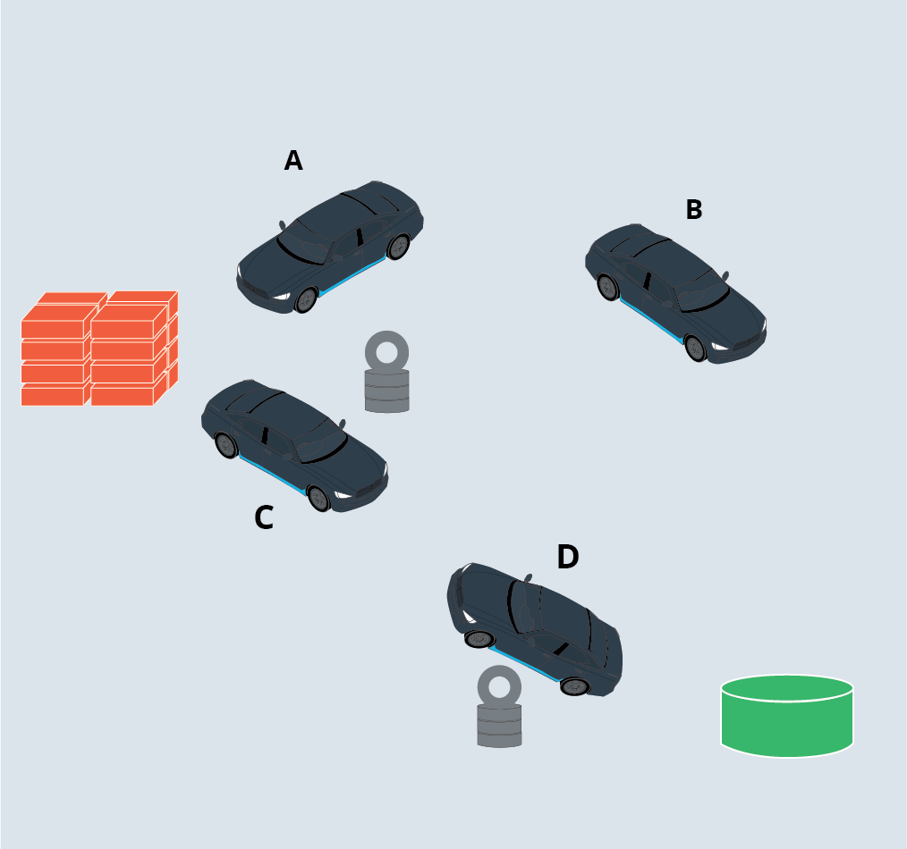

Based on what Carla sees, there are two locations in the junkyard where she might currently be located. Which two locations could be Carla's true location?

Answer: **C** and **D**

The information Carla gave us was good, but it could have been better (but we can forgive her, after all she did just wake up).

Based on what Carla's said so far you've localized her to two possible locations. Which of the following questions could you ask Carla to know exactly where she is? (there are 2 correct answers)

1. How far away are you from the tire?
2. What's directly in front of you: the bricks or the bucket?
3. Are you closer to the bricks or the bucket?

Answer: **2** and **3**

## 2.4 It's getting hot in here
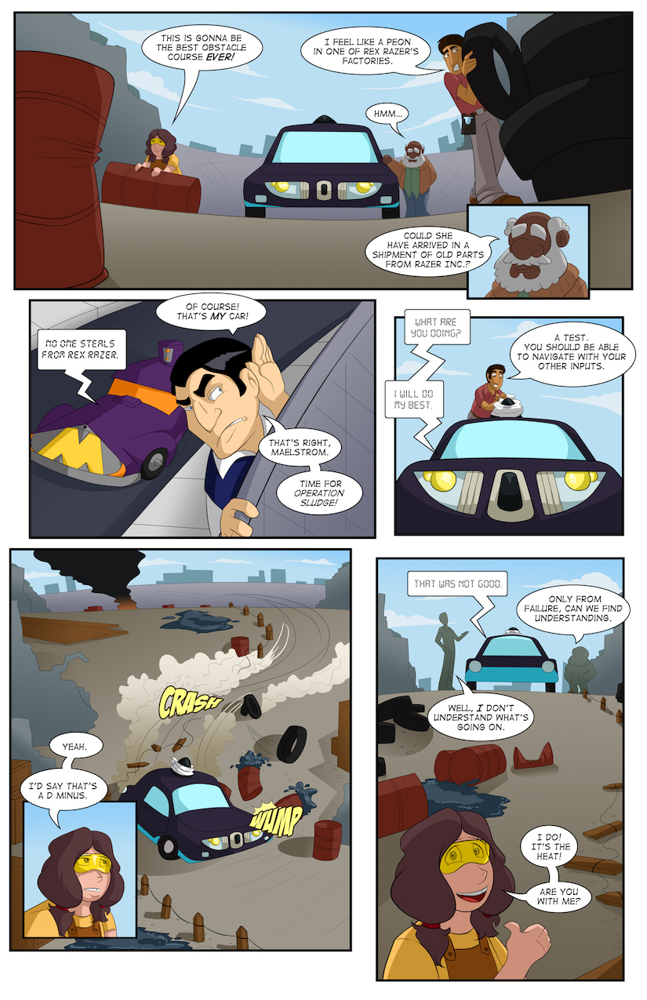

The circumference of the tires, doesn't always stay the same. Factors like heat, altitude and others, can change them from time to time.

An algorithm to constantly measure the diameter of any tire can be as follows:

1. Measure the distance between herself and an object directly behind her.
2. Turn her wheels exactly one full rotation.
3. Make the same distance measurement again.
4. Use the measurements from 1 and 3 to calculate the distance traveled. This is the current circumference of her tires.
5. Perform the appropriate math to compute the current diameter of her tires.

Find the bug in the code

```python
from math import pi


def get_tire_diameter(dist_before_turn, dist_after_turn):

    # TODO - there's a bug in this function! Find and fix it!

    circumference = dist_after_turn - dist_before_turn
    diameter = circumference * pi
    return diameter


get_tire_diameter(10, 11) # ~3.1415
```

Fix:

```python
import math


def get_tire_diameter(dist_before_turn, dist_after_turn):
    circumference = dist_after_turn - dist_before_turn
    return circumference / math.pi


get_tire_diameter(10, 11) # ~0.3183
```

## 2.5 What's the plan, Stan?
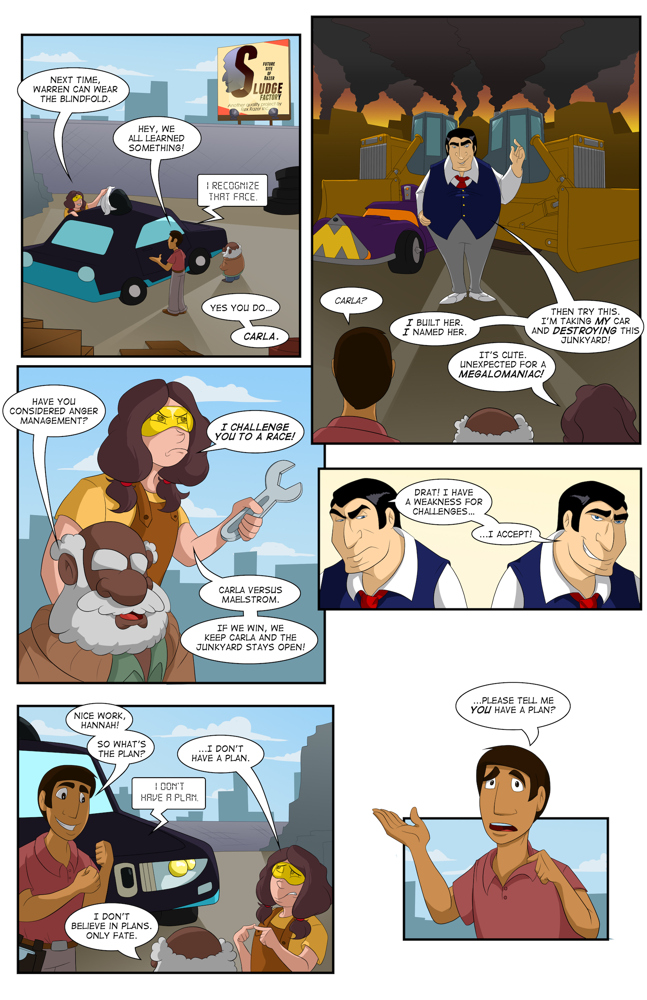

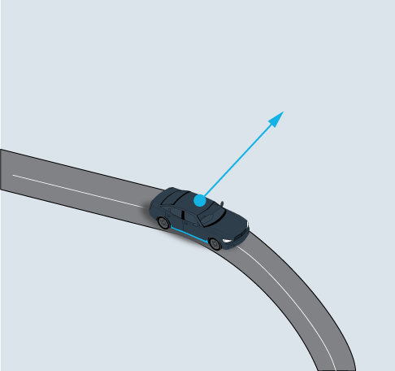
`lateral_acceleration = velocity**2 / radius`

In junkyard conditions, the maximum lateral acceleration that Carla's tires can support is 12m/s&sup2;. If she's traveling at a velocity of 30m/s, what's the sharpest turn (minimum turning radius) she can make?

```python
def minimum_turning_radius(velocity, lateral_acceleration):
    return velocity**2 / lateral_acceleration

minimum_turning_radius(30, 12) # 75m
```

## 2.6 The split decision
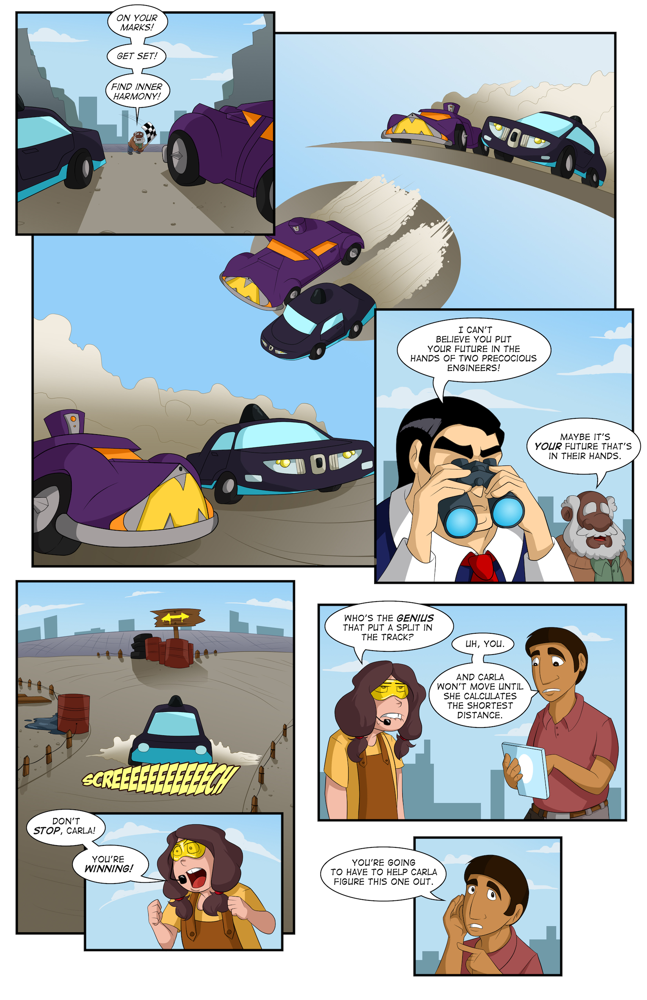

* Go Left - in which case she will travel a total distance of L3 + L4.
* Go Right - in which case she will travel a total distance of L1 + L2.

```python
def make_decision(L1, L2, L3, L4):
    return 'R' if L1 + L2 < L3 + L4 else 'L'

make_decision(2, 3, 4, 4) # 'R'
make_decision(2, 3, 1, 2) # 'L'
```

## 2.7 The end?
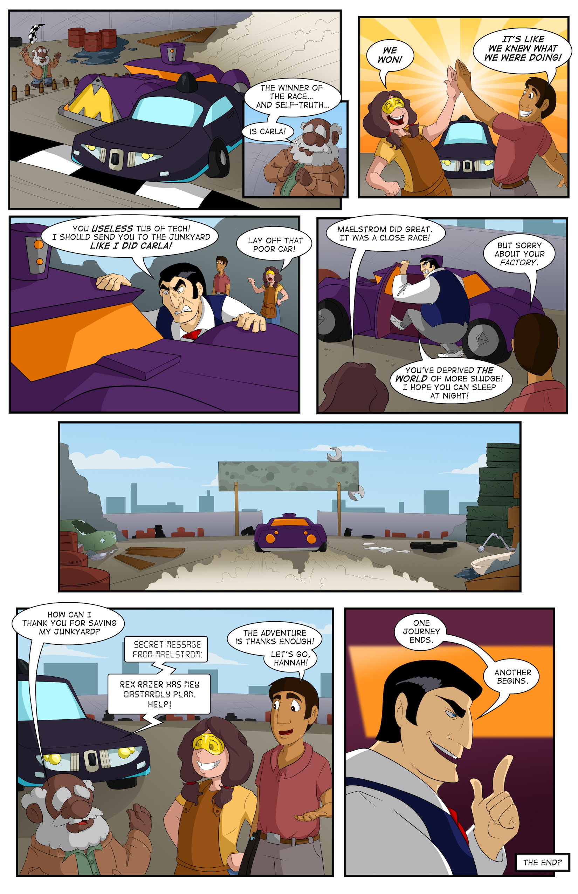

***

# Lesson 3: Get ready
I had no issues neither with the math, nor with the programming, so I seem to be ready to dive right in.

## 3.1 Recommended courses

* [Basic Geometry](https://www.khanacademy.org/math/basic-geo)
* [Intro to Algebra review](https://www.udacity.com/course/intro-algebra-review--ma004)
* [Algebra I](https://www.khanacademy.org/math/algebra)
* [Algebra II](https://www.khanacademy.org/math/algebra2)
* [Trigonometry](https://www.khanacademy.org/math/trigonometry)
* [C++ for programmers](https://www.udacity.com/course/c-for-programmers--ud210)
* [Intro to data analysis](https://www.udacity.com/course/intro-to-data-analysis--ud170)
* [Design of computer programs](https://www.udacity.com/course/design-of-computer-programs--cs212)

## 3.2 Math with python

```python
from sympy import *

init_printing(use_latex="mathjax")

x, y, z = symbols("x y z")

# write polynomials
3*x**2 + 2*x - 7

# automatically simplify
(x + 1) / (x - 1) * (x - 1)

# factor polynomials
factor(x**2 + 2*x + 1)

# factor polynomials with multiple variables
factor(x**2*z + 4*x*y*z + 4*y**2*z)

# expand from factored form
expand( (x+1) ** 3 )

# trig
sin(x)**2 + cos(x)**2

# trig identities
trigsimp( sin(x)**2 + cos(x)**2 )

# calculus - derivatives of polynomials
diff(x**2, x)

# derivatives of more complex expressions
diff( exp(x**2) + sin(x), x)

# integrals
Integral( exp(-x**2) , x)

# indefinite integrals
integrate( cos(x), x )

# definite integrals
integrate( exp(-x), (x, 0, oo) )
```

## 3.3 Graphs and charts with python

```python
"""Line graph"""

# The data
X = range(24) # 0, 1, 2, ... , 23
Y = [0,  1,  2,  4,  8,  15,
     23, 40, 50, 58, 64, 68,
     71, 74, 77, 80, 82, 84,
     86, 88, 89, 90, 91, 92]

# typical plotting starter code
fig, ax = plt.subplots()
ax.plot(X,Y)

# setup the x axis
ax.set_xlabel("Months Spent Programming")
ax.set_xlim(0,24)

# setup y axis
ax.set_ylabel("Programming Ability")
ax.set_ylim(0,100)

# set the title
title = """Self Reported Programming Ability
(0 - 100) Over Time"""
ax.set_title(title)

# show the graph
plt.show()
```

```python
"""
=========================================================
Demo of the histogram (hist) function with a few features
=========================================================

In addition to the basic histogram, this demo shows a few optional
features:

    * Setting the number of data bins
    * The ``normed`` flag, which normalizes bin heights so that the
      integral of the histogram is 1. The resulting histogram is an
      approximation of the probability density function.
    * Setting the face color of the bars
    * Setting the opacity (alpha value).

Selecting different bin counts and sizes can significantly affect the
shape of a histogram. The Astropy docs have a great section on how to
select these parameters:
http://docs.astropy.org/en/stable/visualization/histogram.html
"""

import numpy as np
import matplotlib.mlab as mlab
import matplotlib.pyplot as plt

np.random.seed(0)

# example data
mu = 100  # mean of distribution
sigma = 15  # standard deviation of distribution
x = mu + sigma * np.random.randn(437)

num_bins = 50

fig, ax = plt.subplots()

# the histogram of the data
n, bins, patches = ax.hist(x, num_bins, normed=1)

# add a 'best fit' line
y = mlab.normpdf(bins, mu, sigma)
ax.plot(bins, y, '--')
ax.set_xlabel('Smarts')
ax.set_ylabel('Probability density')
ax.set_title(r'Histogram of IQ: $\mu=100$, $\sigma=15$')

# Tweak spacing to prevent clipping of ylabel
fig.tight_layout()
plt.show()
```

## 3.4 History of self driving cars

* [The DARPA challenge](https://www.youtube.com/watch?v=UFGu15hCtKg)
